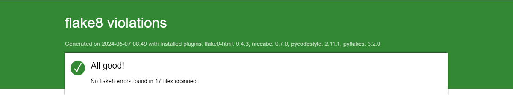
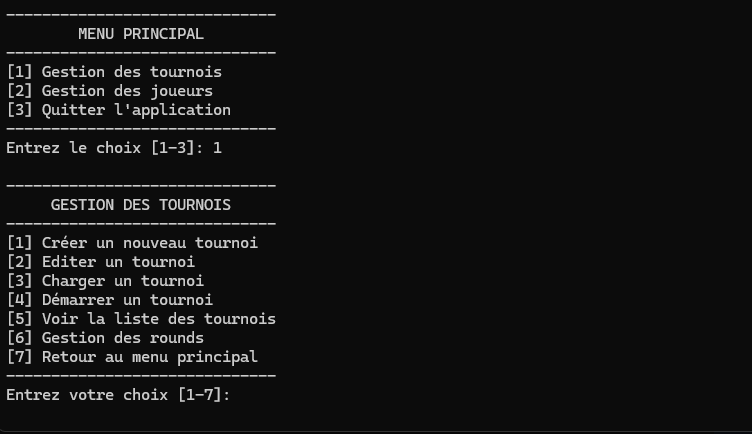
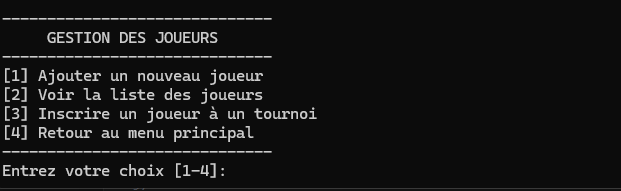
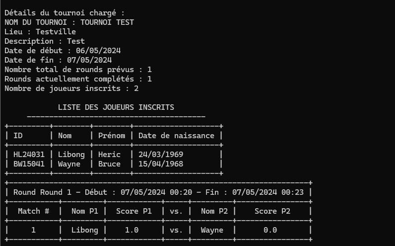

# Chess Game OffLine Software


<p align="center">
  
</p>

## Table des Matières
1. [Présentation](#i---présentation)
2. [Initialisation du projet](#ii---initialisation-du-projet)
   - [Windows, MacOS et Linux](#windows-macos-et-linux)
3. [Générer un rapport flake8](#iii---générer-un-rapport-flake8)
4. [Options des menus](#iv---options-des-menus)
   - [Menu principal et gestion tournoi](#menu-principal-et-gestion-tournoi)
   - [Gestion des Joueurs](#gestion-des-joueurs)
   - [Rapports](#rapports)

## I - Présentation

Chess Game OffLine Software est une application desktop développée en Python destinée à la gestion de tournois d'échecs hors ligne. Cette application permet aux organisateurs de tournois d'échecs de créer, gérer et suivre le déroulement de leurs événements en toute simplicité. Le logiciel permet à l'utilisateur de :

- Créer des tournois
- Inscrire des joueurs
- Gérer les rounds
- Gérer les joueurs
- Afficher les résultats

Les données sont sauvegardées au format JSON dans `util/data/tournaments.json` et `util/data/players.json`.

## II - Initialisation du projet

### Windows, MacOS, Linux

Pour installer et lancer le logiciel sous Windows, suivez ces étapes :

1. Clonez le dépôt GitHub :

    ```bash
    git clone https://github.com/hericlibong/ChessTournamentApp_p4.git
    ```

2. Naviguez dans le dossier du projet :

    ```bash
    cd ChessTournamentApp_p4
    ```

3. Installez un environnement virtuel :

    ```bash
    python -m venv venv
    ```

4. Activez l'environnement virtuel :

    - Sur Windows :
      ```bash
      venv\Scripts\activate
      ```
    - Sur MacOS/Linux :
      ```bash
      source venv/bin/activate
      ```

5. Installez les dépendances :

    ```bash
    pip install -r requirements.txt
    ```

6. Allez dans le dossier de l'application:

    ```bash
    cd ChessTournamentAPP
    ```

7. Lancez l'application :

    ```bash
    python main.py
    ```

## III - Générer un rapport flake8
Pour générer un rapport flake8 afin de vérifier la conformité du code aux standards de codage Python, utilisez la commande suivante :

```
flake8 --format=html --htmldir=flake-report

```
Ouvrir `index` dans le dossier `flake-report` 




## IV - Options des menus

Le menu principal offre plusieurs options pour gérer le tournoi :

### Menu principal et gestion tournoi

<p align="center">
  
</p>

### Gestions des Joueurs

<p align="center">
  
</p>

### Rapports

Le menu des rapports permet d'accéder aux résultats :

<p align="center">
  
</p>


